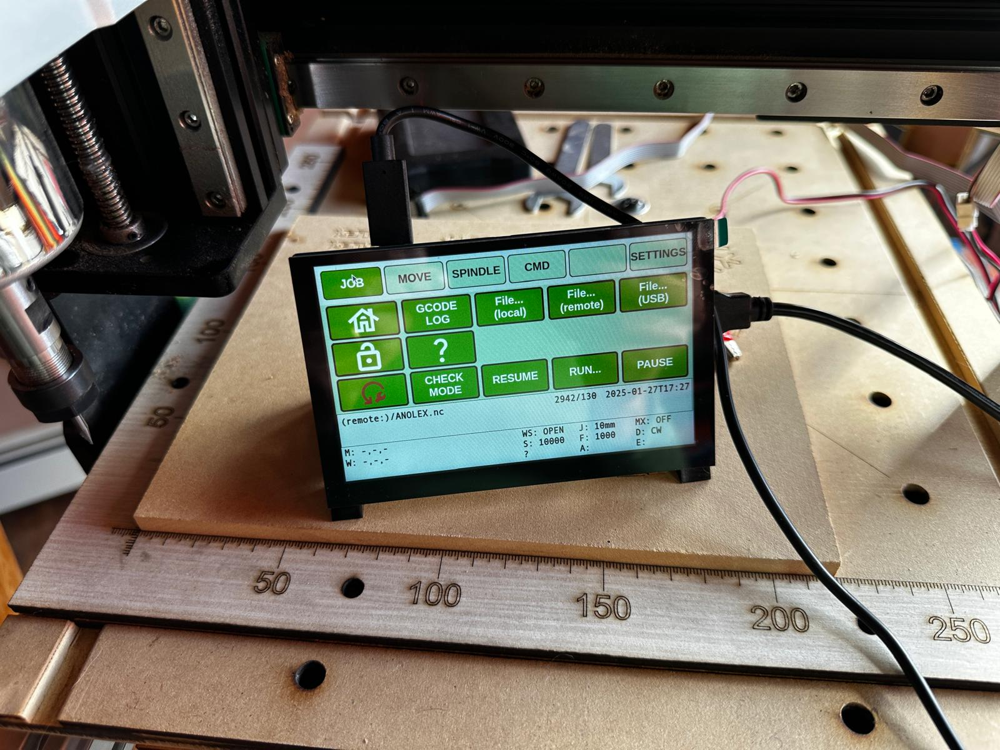

# CNC-controller

#### *Keywords*
Raspberry Pi, CNC, offline, controller, gcode, sender, grbl

## <span style="color: red;">**NOTICE**</span>
<span style="color: red;">This design assumes operation on a local network to simplify user access (i.e no credentials or certificate management).
**As such the controller should not be operated on the open Internet.**</span>

#### *Abstract*
RPi-based offline CNC controller supporting Grbl 1.1 designed around a bright 5" (800x480 pixel) touch screen. The design implements a NodeJS web server running on the localhost (RPi) accessed from a browser running in kiosk mode. It utilizes vanilla HTML, CSS, JavaScript, and Vue3 with no dependencies aside from the node websocket and serialport libraries, simplifying modification, maintenance, and customization. Use of a data model config file allows straightforward customization of all screen views (tabs). Use of a Websocket interface provides direct connection to a backend serial port  (over USB) enabling passing gcode from the web browser directly to the CNC machine. A second websocket provides access to files from multiple local, remote, and USB sources.

<span style="color: aqua;">**Tip**: Although designed to run on a RPi with a limited screen, the controller can just as easily be installed and run on a PC or laptop for demo or easier debugging with the JavaScript console.</span>

Why? How did I get here... see [background][docs/background.md].

#### Screenshot


More screenshots available in the [docs](docs) folder.

## Raspberry Pi Setup
The web provides plenty of tutorials on Raspberry Pi setup, which goes beyond the scope of this project. The setup requires the full Raspberry Pi OS Desktop install, not the lite version. The items below may assist in this application. See [RPi Scripts](rpi_scripts) for example scripts and configuration info. Note, script permissions may be needs to execute.

  - **SSH**: Make sure Secure Shell (SSH) is enabled to access the controller remotely.
  - **tmux**: Installing and configuring tmux makes it possible to perform lasting shell operations, such as running the server, which do not end when the remote login session ends. Install tmux and then enable and start the (/etc/systemd/system) tmux.service. It will run the (/usr/local/bin) tmuxuser script and start a tmux session for each user having a .tmux.init file in their home directory when the RPi boots. When starting a SSH session run (/usr/local/bin) gotmux to reconnect to the prior session.
  - **fonts**: Prefered web fonts, such as the default AndaleMono may need to be installed in /usr/share/fonts/...
  - **node**: You may need to install node. If using nvm or other version manager, you will need to provide a link to the version you wish to use for non-interactive bash shells, such as tmux panes.
    - **libs**: Node requires the additional install of the serialport and websockets libraries, under the CNC-controller server bin folder.
  - **repo**: Clone this repo to the local user.

## SERVER
The [server/bin] cnc.js file, with various other libs, implements a NodeJS-based websever with Websockets. The server does not require any code modification for use, just proper definition of the[server/restricted] config.js file that provides all the setup needed to run. Before use install NodeJS. Then install the NodeJS dependencies from the CNC-controller/server/bin folder, which will place the modules in the node_modules folder under bin.

```bash
    npm install serialport
    npm install ws
```

To start the server simply run:

```bash
    node \<path-to-bin\>/cnc [../restricted/config.js]
```
<span style="color: aqua;">**NOTE**: This assumes the default location of the config file. The config.js file should not be under the root documents folder.</span>

<span style="color: aqua;">**Tip**: Run the server in a TMUX pane to have it stay running after logging out of the RPi.</span>

### Issues

**PORT 80 Access**: You may want to change the server port number >1000 to avoid using a priviledged port OR use IPTABLES to redirect port 80 to a higher port transparently.

**NodeJS Install**: If you install NodeJS with a package manager such as nvm you will need to create a link to the appropriate version for running in a tmux pane launched from a systemd service (i.e. in a non-interactive shell),

## CLIENT
A basic HTML5 page with supporting scripts and a stylesheet serves as the client. The client uses (unbundled) Vue3 for building site page content based on the HTML template (index.html) and data provided in the client configuration file (cncModelData.js)

All views consist of a tab menu, button layout, status area, and optional overlays. Layout assumes a fixed 800x480 pixel screen, easily adjusted by CSS changes alone. The color theme may be changed also by simply changing variable definitions in the CSS file.

### Client Configuration Data
The client configuration file (cncModelData.js) has 4 main parts each described below:
  - parameters
  - tabs
  - buttons
  - macros

#### Parameters
The parameters section defines variables used in defining layout, parsing actions and fields, machine specific details, and and general program functions.

#### Tabs
Each view is referenced as a tab, which aggregates like functions. The layout fixes the number of tabs at 5; however, this could be adjusted based on user preferences. Each tab can have the following properties:
  - **label**: This defines the text dsiplayed for the label.
  - **buttons**: This defines the reference for buttons displayed on the tab. The array has two forms:
    1. A simple one dimensional array that sequentially lists the keys, where an empty field ('') skips a given position. The shift property must not be defined for this form.
    2. A two dimensional array, where each outer element is a button layout. This form requires the presence of the shift property  which determines the set of buttons displayed.
  - **view**: This property selects an alternate view for the button layout, default "buttons" when not defined. The defined CMD tab uses "keyboard" view.
  - **overlay**: Specifies the name of any overlay shown on top of the layout for the specific tab.
  - **shift**: When defined, this property represents the index of the nested buttons array to select which set of buttons to display. 

#### Buttons
The buttons object defines the properties of each button. Values specified in the tabs button definition represent the lookup keys for each button. Buttons have the following properties.
  - **label**: Text displayed on the button if no img property present.
  - **img**: Image displayed on the button, which takes precedence over label.
  - **action**: Code action taken by the button when clicked. In addition to the action, each button generally includes a property referenced by the action. For example, action: 'gcode' will require an additional "gcode" property. Each action may have additional action specific properties. Actions are outlined below with included properties :
    - **action: 'gcode'**
      - 'gcode': Defines a string of gcode to execute. The gcode string represents a JavaScript string literal template allowing for parameter value substitution (from the parameter variable). Multi-line commands may by defined by comma separated fields; however, the resolved line cannot exceed buffer size (128) as no streaming is provided.
    - **action: 'param'**
      - 'param': References the name of the parameter in params to be changed. Either value or template must be defined
      - 'value': New fixed value for the parameter.
      - 'template': Defines a JavaScript string literal template allowing for parameter value substitution for determining the new parameter value.
    - **action: 'macro'**
      - 'macro': May be a string referencing a macro from the macro definitions OR an array of objects specifying the actions and properties to take. A macro is analogous to a series of button presses.
    - **action: 'reset'**
      - Has no properties; used to send a special CTRL-X character to the CNC to perform a soft-reset.
    - **action: 'wait'**
      - 'wait': For macros, wait specifies a delay time in milliseconds before executing the next action.
    - **action: 'call'**
      - 'call': Names an internal function called by the action. Use with caution.
      - 'args': An array of arguments passed to the function.
    - **action: 'key'**
      - 'key': Defines the character for a key pressed (i.e. command keypad), including special cases of 'enter' for the newline key, 'bksp' for backspace 'hback' for history backward, and 'hadv' for history forward (advance). Other keys define the character entered the commandline on the CMD tab.
    - **action: 'shift'**
      - Has no properties; signals the shifting of button layout cycling through all defined arrangements (sub arrays) of the tabs buttons definition.

#### Macros
For organizational puposes. The optional macros section defines a set of macros referenced by buttons, where each macro key defines the reference used by a button and its value defines an array of objects with each object representing the equivalent of a button press.

### Views
The following represent pre-defined client views. Note that all views can be customized by altering, tab and button definitions in the cncModelData.js file.

    Job
    The job view represents the main operational screen and provides all functionality needed to prep the machine to run GCODE files.

    Move
    The Move tab provides functions for jogging the machine position and setting origin values for defining the work coordinate system.

    Spindle
    The Sprindle tab provides moter control operations, mainly for test purposes.

    CMD
    The CMD tag, or command tab, allows keyboard style entry of any GCODE commands including sending them to the machine. This includes a command history that can be recalled to repeat commands without retyping. 

    Settings
    The Settings tab includes machine settings less frequently adjusted.

    "undefined"
    The undefined or blank tab allows for user custimized functions.

#### Status Pane
The status or state pane sits at the bottom of all views. This provides basic command and machine state info, including (top to bottom, left to right):

  - **M:** Machine x,y,z coordinates
  - **W:** Working x,y,z coordinates
  - [MSG] responses
  - **WS:** Websocket connection status
  - **S:** Machine x,y,z coordinates
  - Latest reported machine State
  - **J:** Current jogging step distance
  - **F:** Current pindle feed rate
  - **A:** Last alarm code 
  - **MX:** Motor run state (under manual control)
  - **D:** Motor direction, CW or CCW
  - **E:** Last error code

#### File Pane
The file pane overlay on the job tab shows file stat info on the current file, if any file is loaded, which includes:

  - **pseudo** Pseudo path to current file
  - **size/lines** number of bytes of the file and gcode lines
  - **datetime** File last modified date time stamp

### Actions
The CNC controller has a number of "predefined" functions and capabilities.

  - **Run CNC Jobs**

    The primary function is the ability to process CNC files (i.e. a job) and send the gcode instructions to the CNC machine. It generates a log of each job, which can be reviewed to diagnose problems.

  - **Manual CNC MAchine Operation**
  
    The controller can send GRBL 1.1 commands necessary to manually position and operate the CNC to set workspace parameters such as a job origin.
    

  - **Configure CNC MAchine**

    The controller can send any GRBL 1.1 commands necessary to the CNC to config it's function and behavior. As part of this a report function queries machine  configuration has captures it to a report file where it can be copied to the clipboard

## RPi Commands
To support commanding Raspberry Pi actions (i.e. reboot, shutdown, ...) the server includes an optional third websocket interface, enabled by default. Because of the additional security implications of this, the websocket can be disabled by removing its definition in the config.js and cncModelData.js files. The server/client requires some additional setup in order to use this functionality.

  - **server rpi websocket**: Define 'rpi' websocket url in config.js (defauult).
  - **client rpi websocket**: Define cncModelData parameter wsRPi as true (default)
  - **shutdown (i.e. reboot and halt actions)**: In support of the REBOOT and HALT operations, the server user must be configured via the sudoers file to run the _shutdown_ command without authentication. To do so add a line (using visudo) to the sudoers file such as "\<user\>  localhost=(\<user\>) NOPASSWD: /usr/sbin/shutdown", where \<user\> is the username for the setup.
  - **server action**: In order to use the server restart feature, the usual 'node cnc' start command must be wrapped in some monitor program, such as node-supervisor, as in 'supervisor -i. cnc' in order to automatically start when terminated.
  - **cient action**: In order to use the client restart feature, the chromium command must be wrapped in some monitor program or service, for example (rpi_scripts) kiosk.service.

## TBD
  - Fix the remote file capability to tunnel through server
  - Provide the ability to save job files, logs, and reports whereever.
