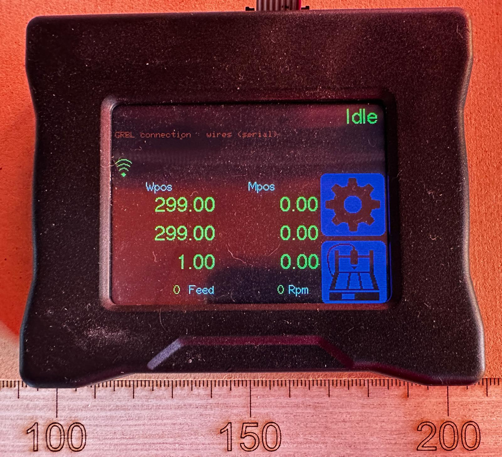
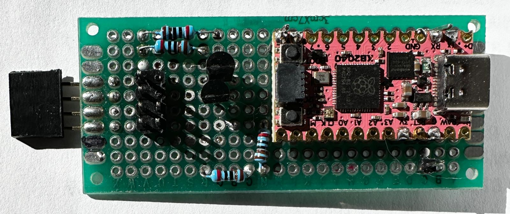

## Development Background

I purchased a AnoleX 3030-Evo Pro CNC router. It did not come with an offline controller and the dirty environment it creates does not make for good operating conditions for a laptop.

So I purchased an offline controller. I wasn't certain it would work, so I went with something cheap. As seen below the small poor quality screen did not work well for my limited vision. I also found that all the commands did not work correctly relative to my model and given its proprietary nature it had limitted flexibility. So time for a little DIY.

### Step 1: Sniff the Proprietary Controller
Fundamentally, a newbee to CNC gcode I needed to learn what the  what the Proprietary Controller was doing/sending. It connects to the CNC control board via an 8-pin ribbon cable, clearly marked with +5V, GND, RX, and TX pins.

I began by building a "sniffer" (shown above) to observe what what was being sent as well as recieved. I used a KB2040 (an Adafruit freebee with a previous order), which has 2 available serial ports and programs with CircuitPython and added a bit of interface circuitry to level-shift signals to the KB2040 3.3V levels. Both serial ports on the sniffer interface RX lines to the controller RX and TX lines, which allows observation of two-way traffic. 

I began thinking this was a 9600 baud interface, but after some scope exploration I discovered it was configured for 115200 8N1.I was surprized the KB2040 running [CircuitPython code](../sniffer/code.py) could keep up with both streams but it did just fine. The [alarm.log](../sniffer/alarm.log) and [unfiltered.log](../sniffer/unfiltered.log) files show some example data exchanges collected.

After this I took a small detour and found I was able to talk directly to the CNC over USB (virtual COM port) from Putty on MS Windows.

## Raspberry Pi Hardware
I used a 4G RPi 4 I had available, thought a less performant model would likely work just fine as it's not a very taxing application. I purchased a small 5" RPi specific touch screen on Amazon for about the same price as the proprietary controller, about $35USD. While I could have bought a bigger screen I thought that as long as it provided better readability, it would suffice without having to deal with an overly bulky unit. I also had a 3A USB-C power adapter for powering the Pi and display and necessary USB printer cable. That's it! It perhaps took a bit more finesse to pack everrything on the screen, but overall, I'm pleased with the result.

## Raspberry Pi Software
The software is relatively straightforward being a full stack web flow. I use NodeJS to do all the backend web server coding. I employ Vue3 as a simple unbundled framework for building the client side supported with vanilla HTML, JavaScript, and CSS. While Vue3 was not necessary, I've used it for other projects before so I'm fairly well versed with it and it greatly simplifies page layout, especially for things like arrays of tabs and buttons. That's it!